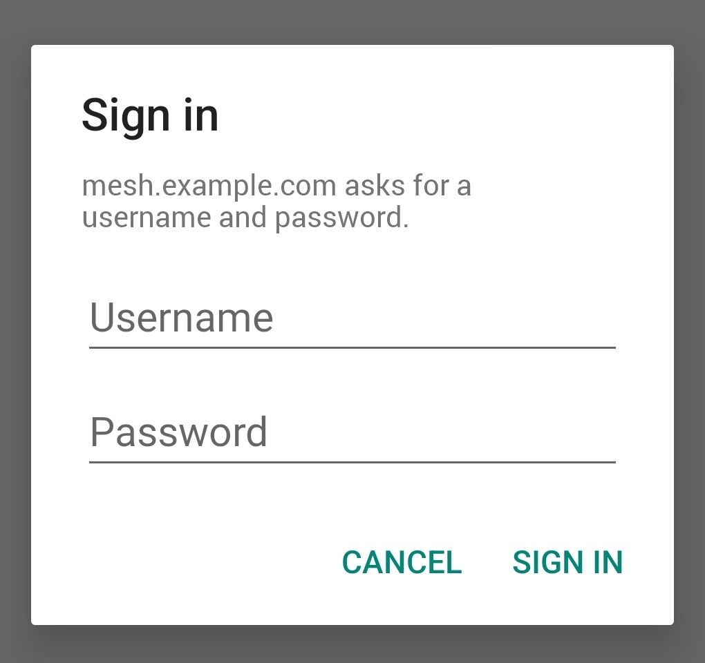

# mc-webui for Android

A small companion app that opens **your own** mc-webui instance full screen — no
address bar, no browser tabs, its own icon in the app drawer. It looks and works
like a native app, because underneath it is the same web interface you already
use in the browser.

The app contains no mesh logic of its own: it asks once for the address of your
mc-webui server and displays it. Everything still runs on your server and your
MeshCore device.

There are two ways to get it. The app is **published on Google Play**, which is
the simplest route and keeps itself updated. The signed `.apk` also stays in
this repository for anyone who would rather not go through the Store — the same
app, signed with the same key, so you can move between the two without
uninstalling anything.

---

## What you need

- **Android 5.0 (Lollipop) or newer**
- A running **mc-webui** instance the phone can reach — either on the same local
  network (e.g. `http://192.168.1.100:5000`) or published over the internet
  through a reverse proxy (e.g. `https://mc-webui.example.com`)

---

## Install from Google Play

| | |
|---|---|
| **Store listing** | https://play.google.com/store/apps/details?id=it.wojtaszek.mc.wrapper |
| **Package** | `it.wojtaszek.mc.wrapper` |
| **App version** | 2.0 |

Open the listing on the phone and tap **Install**. Updates then arrive on their
own, like for any other app from the Store. Skip straight to *Step 4: Connect to
your instance* below — the warnings in steps 2 and 3 apply only to the manual
route.

**Already running the `.apk` from this repository?** Installing from Play
**updates it in place.** The server address and any saved login are kept, and
nothing needs uninstalling — both builds are signed with the same key, which is
exactly what makes that possible. Moving the other way works too.

---

## Or install the `.apk` yourself

The rest of this section is the manual route — useful if you avoid the Play
Store, want a specific version, or would rather verify what you install. It is a
normal and supported way to install Android apps, but Android will warn you a
few times along the way, and the steps below cover those warnings.

---

## Step 1: Download the app

| | |
|---|---|
| **File** | [`android/mc-webui-wrapper.apk`](../android/mc-webui-wrapper.apk) |
| **Direct link** | https://github.com/MarekWo/mc-webui/raw/main/android/mc-webui-wrapper.apk |
| **Size** | 5.2 MB |
| **App version** | 2.0 |
| **Package** | `it.wojtaszek.mc.wrapper` |
| **SHA-256** | `165706d8c8fa0ef9c1095027efaeff863c41681e059be8cc631dd735c0c21f3f` |

Download it directly on the phone, or copy it over from a computer.

**Optional — verify the file.** Only worth doing if you got the file from
somewhere other than this repository:

```bash
# Linux / macOS
sha256sum mc-webui-wrapper.apk

# Windows (PowerShell)
Get-FileHash mc-webui-wrapper.apk -Algorithm SHA256
```

The result must match the SHA-256 above.

---

## Step 2: Allow installation from unknown sources

Android only installs apps from Google Play unless you allow the app that is
doing the installing — usually your browser or the Files app — to install
others. You grant that permission once, and it applies to that app only.

**The easy way** — just start the installation (Step 3). When Android says
*"For your security, your phone is not allowed to install unknown apps from
this source"*, tap **Settings**, turn on **Allow from this source**, and press
back. The installation continues.

**Up front, if you prefer** — Settings → **Apps** → **Special app access** →
**Install unknown apps** → pick the browser or file manager you will use →
**Allow from this source**. The exact wording varies by manufacturer (Samsung,
Xiaomi, and others each name it slightly differently).

---

## Step 3: Install

1. Open the downloaded `mc-webui-wrapper.apk` — from the browser's download
   notification, or from **Files → Downloads**
2. Tap **Install**
3. **Play Protect** may show *"Unsafe app blocked"* or *"App scan
   recommended"*. This is Google's standard notice for apps that did not come
   from the Play Store — it is not a detection of anything in the app. Choose
   **More details → Install anyway** (or **Don't send / Install** if it offers
   to upload the file for scanning)
4. Tap **Open**, or launch **mc-webui** from the app drawer

To remove it later: long-press the icon → **Uninstall**, like any other app.

---

## Step 4: Connect to your instance

On the first run the app asks for the address of your server:

<p align="center">
  
</p>

Type the full address, including the protocol and — for a local instance — the
port:

| Your setup | What to enter |
|---|---|
| mc-webui on the local network | `http://192.168.1.100:5000` |
| Behind a reverse proxy with a certificate | `https://mc-webui.example.com` |
| On a non-standard port behind a proxy | `https://mc-webui.example.com:8443` |

Then tap **SAVE & CONNECT**.

> **Type `http://` explicitly for local instances.** If you leave the protocol
> out, the app assumes `https://` and the connection to a plain local server
> will fail.

The address is remembered, so every later launch goes straight into mc-webui.

### Changing the address later

Press **Back** on the first mc-webui page and the app asks what you want:
**Change server** brings up the address form, **Exit** closes the app, **Cancel**
stays where you were. (Deeper inside the interface, Back simply goes back a
page, as in a browser.)

The address form also appears on its own when the app cannot reach the server —
wrong address, server down, phone off the network. Either way the form opens
**pre-filled with the address you are using**, and nothing is overwritten until
you tap **SAVE & CONNECT**: a dropped connection never costs you the address.

### Servers that ask for a password

If your instance sits behind a reverse proxy configured to require a login
(HTTP Basic authentication — for example an **Access List** in Nginx Proxy
Manager), the app asks for it the first time it connects, from version 1.3:

<p align="center">
  
</p>

Enter the username and password your proxy expects and tap **SIGN IN**. They are
remembered per server address, so later launches go straight in. Get them wrong
and the same prompt comes back on the next attempt, with the username filled in.
Tapping **Cancel** returns to the address form.

This only ever appears when the server actually asks for a password. On an
instance without one — local `http://` or a proxy with no access control — you
will never see this screen, and nothing about the app changes.

> **Turning the password on, or changing it, while the app is open.** The prompt
> comes up when the app loads a page, not when a request it makes in the
> background is refused. So if you switch authentication on — or change the
> password — with the app already running, it keeps trying the old credentials
> and the interface stops updating rather than asking you anything. Close the
> app and open it again, and it will ask properly.

---

## What works, and what doesn't

Everything you do in mc-webui itself works as in the browser: channels, direct
messages, contacts, the console, My Repeaters, the Path Analyzer, maps,
settings, themes. Links to other sites — a URL in a message, the packet
analyzer — open in your normal browser, so the app stays on your instance.

A couple of things depend on how your instance is reachable:

| Feature | In the app |
|---|---|
| **Notifications** for new messages | **Work,** from version 1.1. Turn them on in the mc-webui menu as usual; Android asks for its own permission the first time. They arrive while the app is open or recently in the background — Android eventually suspends a backgrounded app, and notifications stop until you open it again. Unlike a browser, these also work over plain `http://`. Tapping one reopens the app |
| **Scanning a QR code** (Add Contact → Scan QR) | **Works on `https://` instances.** Android asks for camera permission the first time. Over plain `http://` the camera stays blocked — that is a browser rule, not an app limitation, and Chrome on the same phone behaves identically. Use **Paste URI** or **Manual entry** there |
| **Downloading files** (e.g. database backups) | **Works.** Files land in the phone's **Downloads** folder, with the usual download notification |
| **HTTPS with a self-signed certificate** | **Refused,** with an "SSL error" message. Use a valid certificate (e.g. Let's Encrypt), or plain `http://` on the local network |

---

## Security notes

- **Install the app from Google Play, or the `.apk` only from this repository**
  (or from the project's GitHub Releases page). An `.apk` from anywhere else is
  a different app, no matter what it is called
- The app stores two things on the phone: **the server address you typed**, and
  — only if your server asks for a login — **the username and password for it**.
  Both live in the app's private storage, which no other app can read. No
  messages, keys, or contacts — those stay on your server and your MeshCore
  device
- **Plain `http://` is allowed** so that local instances work without a
  certificate. On a home network that is fine; over the internet, put mc-webui
  behind a reverse proxy with HTTPS and some form of access control. The app has
  no login of its own, but it does **support a proxy that requires one** (see
  *Servers that ask for a password* above) — and over `https://` those
  credentials are encrypted in transit like everything else
- **Permissions:** internet access; the camera, only when you use QR scanning
  and only after you allow it; notifications, only after you turn them on in
  the menu and allow them; and file storage on Android 9 and older, only for
  saving a download. Nothing else — no contacts, no location, no background
  services
- Every release is **signed with the same key** — the Play build included, because
  the key was registered with Play App Signing rather than letting Google
  generate its own (certificate SHA-256
  `42:58:57:b3:60:0c:1b:89:2f:8d:3b:2a:5c:46:8b:fe:17:c0:d2:1f:6c:12:24:33:a4:e1:1b:51:be:9b:d2:30`),
  which is also why updates install straight over the previous version

---

## How it is built

A minimal Android WebView wrapper: one screen for the server address, one
full-screen WebView for mc-webui itself, and a saved preference between them.
No analytics, no third-party services, no background activity — when the app is
closed, nothing of it runs.

The complete source is in [`android/src/`](../android/src), and
[`android/README.md`](../android/README.md) describes how to build it yourself
if you would rather not trust a prebuilt `.apk`.

---

## See also

- [Privacy Policy](privacy-policy.html) — what the app stores on the phone, and
  why none of it ever reaches anyone but your own server
- [User Guide](user-guide.md) — everything the interface itself can do
- [PWA Notifications](user-guide.md#pwa-notifications) — how the same
  notifications behave in the browser
- [Troubleshooting](troubleshooting.md) — when the server itself misbehaves
