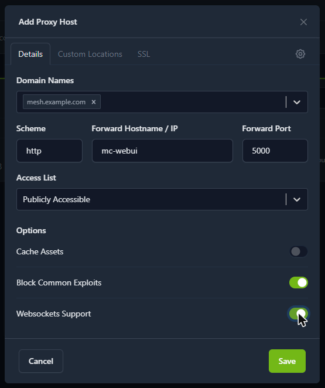
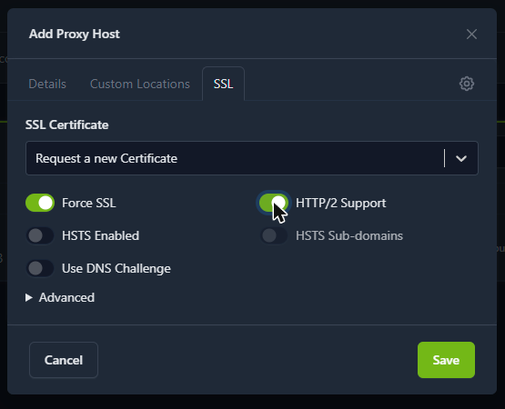
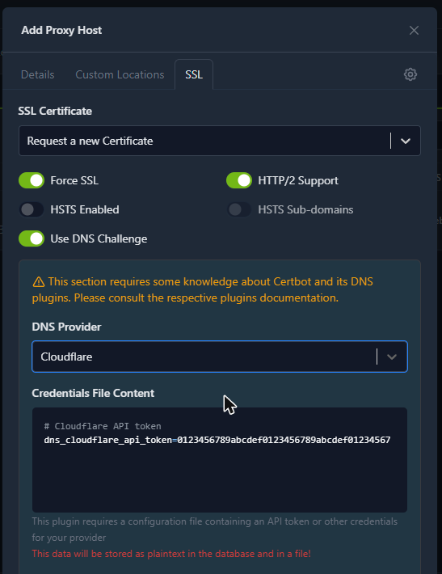
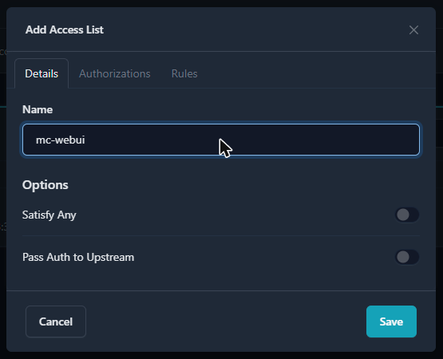
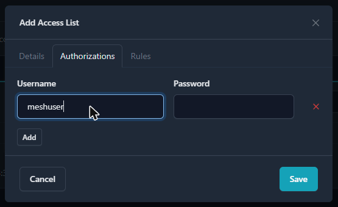
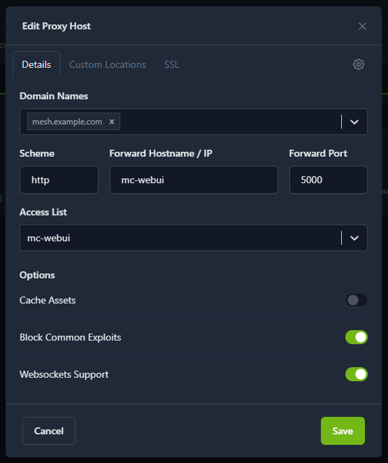
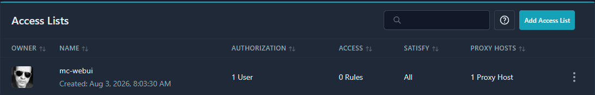

# HTTPS Setup

By default mc-webui speaks plain HTTP. This guide turns on an optional HTTPS front end
using [Nginx Proxy Manager](https://nginxproxymanager.com/) (NPM) — a small web UI where
you point-and-click your way to a certificate, instead of editing nginx config files.

Everything here is opt-in. If you skip this document, nothing about your installation
changes.

## Why bother

- **Encrypted traffic.** Nobody on your network reads your messages or your device
  configuration in transit.
- **Copy buttons, and more, start working.** Browsers restrict a set of features to a
  *secure context* — HTTPS, or `http://localhost`. Open mc-webui over plain HTTP at
  `http://192.168.1.50:5000` and the modern clipboard API simply does not exist, so copy
  buttons fall back to an older, less reliable method. The same applies to installing
  mc-webui as an app on a phone, and to browser notifications.
- **A real hostname.** `https://mesh.example.com` instead of an IP and a port number.
- **Optional password protection.** NPM's *Access Lists* can put HTTP authentication in
  front of mc-webui, which has no login of its own — see *Require a login* in Step 5.
  This is what makes publishing the instance to the internet reasonable.

## How it fits together

```
   browser  ──HTTPS(443)──►  nginx-proxy-manager  ──HTTP──►  mc-webui  ──►  MeshCore device
                             (container: mc-webui-proxy)     (container: mc-webui)
```

Both containers belong to the same Compose project, so they share a private Docker
network. The proxy reaches the app as `http://mc-webui:5000` over that network — the app
does not need to publish a port at all, and the traffic between them never leaves the
host.

---

## Step 1 — Turn it on

Edit `.env` in your mc-webui directory (create it from `.env.example` if you have none)
and add:

```ini
COMPOSE_PROFILES=https
```

Then start it the usual way:

```bash
docker compose up -d --build
```

That is the whole installation. The proxy is defined in the project's `docker-compose.yml`
behind a Compose *profile*, so it stays completely inert until that line exists — and
`mcupdate` picks it up automatically from then on. **Do not edit `docker-compose.yml`
yourself**: it is tracked in git, and a local edit will make the next update fail with a
merge conflict.

Check that both containers are up:

```bash
docker compose ps
```

You should see `mc-webui` and `mc-webui-proxy`.

> **Port 80 or 443 already in use?** If something else on the host owns those ports,
> `docker compose up` fails with `address already in use`. Either stop the other service,
> or move the proxy's ports with `NPM_HTTP_PORT` / `NPM_HTTPS_PORT` in `.env`. Note that
> Let's Encrypt's HTTP validation requires the public port 80, so moving it rules that
> method out — use the DNS method (Option B) instead.

## Step 2 — Log in to the proxy admin UI

Open `http://<your-server>:81`. On first run you get a short setup form where you create
your own administrator account — name, email and password. There is no default login to
change afterwards.

Keep this panel on the local network and **do not forward port 81 through your router**:
it can route traffic anywhere inside your network, and it is served over plain HTTP.

> Older Nginx Proxy Manager releases (before 2.15) instead shipped a built-in
> `admin@example.com` / `changeme` account that you were expected to change on first
> login. If you pinned an older image with `NPM_IMAGE`, that is what you will see.

## Step 3 — Create the proxy host

Go to **Hosts → Proxy Hosts → Add Proxy Host** and fill in the **Details** tab:

| Field | Value |
|---|---|
| Domain Names | `mesh.example.com` — your hostname, or the server's IP address |
| Scheme | `http` |
| Forward Hostname / IP | `mc-webui` |
| Forward Port | `5000` |
| Cache Assets | off |
| Block Common Exploits | on |
| **Websockets Support** | **on — this one is not optional** |

<p align="center">
  
</p>

> ### Websockets Support must be on
>
> mc-webui pushes new messages to open pages over a WebSocket. Without this switch, nginx
> does not forward the connection upgrade, the page silently drops back to long-polling,
> and a browser only allows six long-polling connections per address **across all tabs**.
> Two or three open tabs then exhaust that budget and the interface crawls — clicks take
> ten or twenty seconds while the server sits idle. It looks exactly like an overloaded
> server and it is not one. If you have seen that symptom before, this is the same bug
> coming back through the proxy.

Save. `http://mesh.example.com` should now show mc-webui. Certificates come next.

> **Tip:** if you create the certificate *first* (Step 4), it appears in the proxy host's
> SSL tab as a ready-made choice and you can attach it while creating the host, saving a
> round trip. The order below is written the other way only because the proxy host is the
> part everyone needs.

## Step 4 — Choose a certificate

Three routes, depending on whether you have a domain name and whether your server is
reachable from the internet. All of them start on the **Certificates** page →
**Add Certificate**, which offers *Let's Encrypt via HTTP*, *Let's Encrypt via DNS* and
*Custom Certificate*. Whatever you create there is then selected on the proxy host's
**SSL** tab.

### Option A — Let's Encrypt with a public domain (the easy case)

**Requires:** a domain name pointing at your public IP, and port 80 forwarded from your
router to this host.

**Certificates → Add Certificate → Let's Encrypt via HTTP**, type your domain into
*Domain Names* and press Enter, then Save.

Then edit the proxy host → **SSL** tab → pick the certificate from the list → enable
**Force SSL** and **HTTP/2 Support** → Save.

<p align="center">
  
</p>

The screenshot shows the shortcut mentioned above: **Request a new Certificate** right on
the proxy host's SSL tab, which creates the certificate and attaches it in one step
instead of visiting the Certificates page first. Leave **HSTS Enabled** off for now.

That is it. The certificate is trusted by every browser and phone with no warnings, and
NPM renews it automatically.

### Option B — Let's Encrypt with a DNS challenge (best for LAN-only servers)

**This is the option most home installations want.** It gives you a fully trusted
certificate on a server that is *not* exposed to the internet at all — no port
forwarding, nothing reachable from outside.

The trick: Let's Encrypt proves you own the *domain* by having you write a token into its
DNS, and never connects to your server. Nothing stops that domain's A record from
pointing at a private address such as `192.168.1.50`.

**Requires:** a domain you own, hosted at a DNS provider NPM supports (Cloudflare,
deSEC, DuckDNS, Hetzner, OVH, and around a hundred others), and an API token from it.

First, create the token at your DNS provider. Two things matter, and both bite later
rather than now:

- **Scope it to the single zone** you are certifying, with permission to edit DNS records
  and nothing else. On Cloudflare that is *My Profile → API Tokens → Create Token →
  "Edit zone DNS" template → Zone Resources: Include → Specific zone*.
- **Give it no expiry date.** The certificate renews itself roughly every 60 days using
  this token; a token with a TTL will break a renewal months from now, silently, and the
  first you hear of it is an expired certificate.

Then, in NPM:

1. In your DNS, point `mesh.example.com` at the server's LAN address, e.g. `192.168.1.50`.
2. **Certificates → Add Certificate → Let's Encrypt via DNS.**
3. Type the domain into *Domain Names* and press Enter.
4. *Key Type* — leave **ECDSA 256** unless you must support genuinely ancient clients.
5. Pick your provider under *DNS Provider*. NPM then shows a *Credentials File Content*
   box pre-filled with a template for that plugin — replace the placeholder with your
   real token, keeping the key name. For Cloudflare that is exactly two lines:

   ```ini
   # Cloudflare API token
   dns_cloudflare_api_token=<your token>
   ```

   NPM warns, correctly, that this is stored in plain text in its database and in a file
   on the server. Certbot needs to read it at every automatic renewal, which is why it is
   kept — and why scoping the token to one zone matters.

   <p align="center">
     
   </p>

   The token shown in that box is NPM's own placeholder, not a real one — replace it.
6. Leave *Propagation Seconds* empty to use the plugin's default. If issuing fails on a
   timeout, come back and try 60.
7. Save, and give it up to a minute. The certificate appears in the list with an expiry
   date and the status *Not Used* — that just means no proxy host has claimed it yet.
8. Edit the proxy host → **SSL** tab → select the certificate → **Force SSL** and
   **HTTP/2 Support** → Save.

Leave **HSTS** off until you have run this way for a while. Browsers remember it for
months, and backing out of it is awkward.

Certificate renewal is automatic and equally invisible. Everyone on the LAN reaches
`https://mesh.example.com` with a green padlock, including phones and the Android app.

### Option C — Self-signed, or a private CA (no domain at all)

**Use when you only ever reach the server by IP address**, e.g. `https://192.168.1.50`.

First, the part that is worth being clear about: **no public certificate authority will
ever issue a certificate for a private address** like `192.168.1.50` — nobody can prove
they own an address that exists identically inside every home network on earth. Let's
Encrypt has recently begun issuing certificates for *public* IP addresses, but those are
short-lived and NPM's certificate integration does not support them. So for a LAN
address, the choice is a certificate you sign yourself.

NPM cannot generate one, so create it on the host and upload it. **The `subjectAltName`
line is what matters** — browsers ignore the old Common Name entirely, and a certificate
without a matching SAN is rejected outright:

```bash
openssl req -x509 -nodes -newkey rsa:2048 -days 3650 \
  -keyout mc-webui.key -out mc-webui.crt \
  -subj "/CN=mc-webui" \
  -addext "subjectAltName=IP:192.168.1.50,DNS:mc-webui.local" \
  -addext "basicConstraints=critical,CA:FALSE" \
  -addext "keyUsage=digitalSignature,keyEncipherment" \
  -addext "extendedKeyUsage=serverAuth"
```

Replace the IP with your server's. List every name and address you will actually type
into the browser — each one needs to be in that SAN list.

Then in NPM: **Certificates → Add Certificate → Custom Certificate**, upload
`mc-webui.key` as the key and `mc-webui.crt` as the certificate (leave the intermediate
field empty), and select it on the proxy host's SSL tab.

**What you get:** real encryption, and the secure-context browser features work. **What
you do not get:** a green padlock. Every browser shows an interstitial warning the first
time, which you click through once per browser.

If the warnings bother you, use **[mkcert](https://github.com/FiloSottile/mkcert)**
instead. It creates a small certificate authority of your own, and installs it into the
trust store of the machines you choose — then those machines see no warning at all:

```bash
mkcert -install                            # once, per machine that should trust it
mkcert 192.168.1.50 mc-webui.local         # produces a .pem cert and key to upload
```

### Browsing by IP address needs one extra step

Put the IP straight into the proxy host's *Domain Names* field — NPM accepts it. That is
not quite enough on its own, though, and the reason is worth understanding.

When you type a hostname, the browser tells the server which name it is asking for, as
part of setting up the encrypted connection (SNI). When you type an IP address it sends
nothing — the standard forbids it. Nginx then falls back to a *default* server for
port 443, and since version 2.15 Nginx Proxy Manager ships one whose entire job is to
refuse such connections. The browser shows a connection error before it ever gets as far
as a certificate warning.

Two ways out.

**The clean one: give the server a name.** Add a DNS entry on your router (or Pi-hole,
or whatever serves DNS on your network) pointing e.g. `mesh.lan` at the server, and use
that. One entry covers every device, including phones — where you cannot edit a hosts
file. Everything then works as described above, and this is worth doing anyway.

**The direct one: let the proxy answer unnamed requests.** This project ships a
replacement for that default server at [`docker/npm-default-site.conf`](../docker/npm-default-site.conf)
— same file with the refusing block removed, so your proxy host answers instead and
presents its certificate. Enable it by creating `docker-compose.override.yml` next to
`docker-compose.yml`:

```yaml
services:
  npm:
    volumes:
      - "./docker/npm-default-site.conf:/etc/nginx/conf.d/default.conf"
```

Then `docker compose up -d`. That filename is deliberately ignored by git, so it survives
updates untouched.

> **Do not add `:ro` to that line.** The proxy container adjusts ownership of its config
> files at startup; on a read-only mount that fails, and it aborts the whole startup —
> the container comes up but nginx never starts listening, so *everything* refuses
> connections. It is a confusing failure to debug. Mount it writable, as above.

## Step 5 — Tighten it up (optional)

Once HTTPS works, four optional steps make it the only way in.

Two of them do different jobs, and it is worth being clear about which is which:
**a login** keeps strangers out of an instance published to the internet, while
**closing port 5000** keeps your own network from reaching the app around the proxy.
Publishing to the internet wants both.

**Force HTTPS.** On the proxy host's SSL tab, enable **Force SSL** so plain HTTP requests
redirect. Leave HSTS off until you are sure everything works — HSTS is remembered by
browsers for months and is awkward to undo.

**Require a login.** mc-webui has no accounts of its own, so anyone who can reach it can
use it. If the instance is published to the internet, this is the step that matters most.
NPM calls it an **Access List**, and it adds the browser's own username/password prompt in
front of everything.

1. **Access Lists** → **Add Access List**
2. On **Details**, give it a name (`mc-webui` will do). Leave **Satisfy Any** off — with it
   on, satisfying *any one* condition is enough, which is not what you want when the
   password is the only condition. Leave **Pass Auth to Upstream** off too; mc-webui does
   not read the `Authorization` header, so there is nothing to pass on

   <p align="center">
     
   </p>

3. On **Authorizations**, add a username and password. Add more than one if several people
   use the instance — each gets their own

   <p align="center">
     
   </p>

4. **Rules** is optional: it allows or denies whole IP addresses and ranges, on top of the
   password
5. Save, then go to **Hosts → Proxy Hosts**, open your host's **⋮ → Edit**, and set
   **Access List** to the one you just created. Save

   <p align="center">
     
   </p>

The host's **ACCESS** column should now name your list instead of *Publicly Accessible*,
and the Access Lists page counts the hosts using it:

<p align="center">
  
</p>

Every path is covered — the interface, the API, and the websocket — so there is no way in
that skips the prompt.

> **Check the Android app after turning this on.** [App version 1.3](android-app.md) or
> newer handles the prompt; older versions do not and will show the proxy's bare "401
> Authorization Required" page instead. Either way, an app that was *already running* when
> you enabled the login will not notice — it keeps using the old credentials and quietly
> stops updating. Close it and open it again.

**Let the app see the real client.** In `.env`:

```ini
MC_TRUST_PROXY=true
```

Without it, mc-webui sees every request as coming from the proxy container and believes
the connection is plain HTTP. With it, the log shows real client addresses. Enable it
**only** when the app is reached through the proxy — anyone able to talk to port 5000
directly can forge those headers.

**Close the plain HTTP port.** Also in `.env`:

```ini
MC_BIND_ADDRESS=127.0.0.1
```

Port 5000 then answers only on the machine itself, so the network sees nothing but HTTPS.
The proxy is unaffected — it reaches the app over the internal Docker network. Set this
**after** HTTPS works, not before, or you will lock yourself out. To undo it, delete the
line and run `docker compose up -d`.

This matters more than it looks once you have set up a login. Port 5000 bypasses the proxy
entirely, and with it the password, the certificate and the access log — so as long as it
answers on the network, the login only guards one of the two doors. Note the port is not
removed, only bound to the loopback address: anyone with a shell on the server can still
reach the app there without a password. If your testers still use `http://<server>:5000`
on the LAN, as on this project's own test server, leave this one off and rely on the
login instead.

Apply either change with `docker compose up -d`.

## The Android app

The [Android wrapper](android-app.md) accepts both `http://` and `https://` addresses, but
it **rejects certificates it does not trust** and shows an SSL error instead of the page.
In practice:

- Options A and B work perfectly — enter `https://mesh.example.com` and you are done.
- Option C (self-signed) does **not** work in the app. Android's WebView does not trust
  certificates you added to the phone manually, and there is no way around that from
  inside the app. Use the app over `http://` on the LAN, or move to Option B.
- An **Access List** works from app version 1.3 on: the app asks for the username and
  password on the first connection and remembers them per server address. Older versions
  cannot answer the prompt at all. See *Servers that ask for a password* in
  [android-app.md](android-app.md).

## Updating and removing

**Updating** needs nothing special — `mcupdate` (or `docker compose up -d --build`) pulls
both containers as usual. The proxy's configuration and certificates live in
`./data/npm` and `./data/letsencrypt` and survive rebuilds.

**Removing HTTPS:** delete or comment out `COMPOSE_PROFILES=https` in `.env`, then:

```bash
docker compose --profile https down
docker compose up -d
```

Also remove `MC_BIND_ADDRESS` and `MC_TRUST_PROXY` if you set them, or the app stays
unreachable from the network. The proxy's data directories are left in place; delete
`./data/npm` and `./data/letsencrypt` by hand if you want them gone.

## Troubleshooting

| Symptom | Cause and fix |
|---|---|
| The interface crawls with 2–3 tabs open; clicks take 10–20 s | **Websockets Support** is off on the proxy host. Turn it on (Step 3). |
| `502 Bad Gateway` | The app container is down or still starting — `docker compose ps`, then `docker compose logs mc-webui`. Also check Forward Hostname is `mc-webui` (the container name), not `localhost`: inside the proxy container, `localhost` is the proxy itself. |
| `address already in use` on startup | Something else on the host holds port 80 or 443. Stop it, or set `NPM_HTTP_PORT` / `NPM_HTTPS_PORT`. |
| Let's Encrypt fails with a connection or timeout error | HTTP-01 validation could not reach port 80 from the internet. Check the router forward, or switch to a DNS challenge (Option B). |
| Browser warns about the certificate even after installing a private CA | The address you typed is not in the certificate's `subjectAltName`. Reissue with every name and IP you use. |
| The Android app shows an SSL error | A self-signed certificate — the app cannot trust it. See the Android section above. |
| HTTPS works by hostname but not by IP address | The proxy refuses connections that carry no hostname. See "Browsing by IP address" above. |
| After mounting `npm-default-site.conf`, *nothing* answers — not even port 81 | The mount has `:ro`. Remove it and run `docker compose up -d`. |
| Locked out after setting `MC_BIND_ADDRESS` | On the server itself: remove the line from `.env` and run `docker compose up -d`. |
| The login prompt never appears, and the site opens as before | The Access List exists but is not attached to the proxy host. **Hosts → Proxy Hosts** — the **ACCESS** column must name your list, not *Publicly Accessible*. |
| The Android app shows "401 Authorization Required", or stops updating after you enable a login | App older than 1.3 cannot answer the prompt — update it. If it is 1.3 or newer, it was running when you turned the login on: close it and open it again. |
| Proxy container keeps restarting | Check `docker compose logs npm`. A common cause is `./data/npm` sitting on a synced folder (Synology Drive, Dropbox) — the sync client corrupts its SQLite database. Move it with `NPM_DATA_DIR`. |

## See also

- [Nginx Proxy Manager documentation](https://nginxproxymanager.com/guide/)
- [architecture.md](architecture.md) — how mc-webui itself is put together
- [android-app.md](android-app.md) — the Android wrapper
