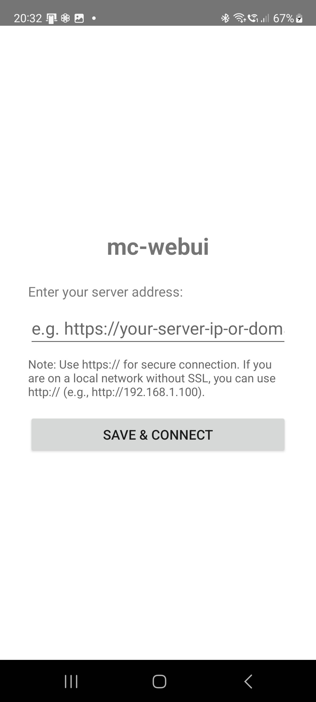

# mc-webui User Guide

This guide covers all features and functionality of mc-webui. For installation instructions, see the main [README.md](../README.md).

## Table of Contents

- [Viewing Messages](#viewing-messages)
- [Managing Channels](#managing-channels)
- [Region Scopes](#region-scopes)
- [Message Archives](#message-archives)
- [Sending Messages](#sending-messages)
- [Message Content Features](#message-content-features)
- [Direct Messages (DM)](#direct-messages-dm)
- [Global Search](#global-search)
- [Contact Management](#contact-management)
- [Adding Contacts](#adding-contacts)
- [DM Path Management](#dm-path-management)
- [Interactive Console](#interactive-console)
- [My Repeaters (Repeater Administration)](#my-repeaters-repeater-administration)
- [Path Analyzer](#path-analyzer)
- [Device Dashboard](#device-dashboard)
- [Quick-Access FAB Buttons](#quick-access-fab-buttons)
- [Settings](#settings)
- [System Log](#system-log)
- [Database Backup](#database-backup)
- [Network Commands](#network-commands)
- [PWA Notifications](#pwa-notifications)
- [Notifications Tab](#notifications-tab)
- [Android App](#android-app)

---

## Viewing Messages

The main page displays chat history from the currently selected channel. The app uses an intelligent refresh system that checks for new messages every 10 seconds and updates the UI only when new messages actually arrive.

### Unread Notifications

- **Bell icon** in navbar shows total unread count across all channels
- **Channel badges** display unread count per channel (e.g., "Malopolska (3)")
- Messages are automatically marked as read when you view them
- Read status persists across browser sessions and syncs across devices

By default, the live view shows messages from the last 7 days. Older messages are automatically archived and can be accessed via the date selector.

On wide screens (tablets/desktops), a sidebar shows the channel list on the left side for quick switching.

---

## Managing Channels

Access channel management:
1. Click the menu icon (☰) in the navbar
2. Select "Manage Channels" from the slide-out menu

### Creating a New Channel

1. Click "Add New Channel"
2. Enter a channel name (letters, numbers, _ and - only)
3. Click "Create & Auto-generate Key"
4. The channel is created with a secure encryption key

### Sharing a Channel

1. In the Channels modal, click the share icon next to any channel
2. Share the QR code (scan with another device) or copy the encryption key
3. Others can join using the "Join Existing" option

### Joining a Channel

**For private channels:**
1. Click "Join Existing"
2. Enter the channel name and encryption key (received from channel creator)
3. Click "Join Channel"
4. The channel will be added to your available channels

**For public channels (starting with #):**
1. Click "Join Existing"
2. Enter the channel name (e.g., `#test`, `#krakow`)
3. Leave the encryption key field empty (key is auto-generated based on channel name)
4. Click "Join Channel"
5. You can now chat with other users on the same public channel

### Deleting a Channel

1. In the Channels modal, click the delete icon (trash) next to any channel
2. Confirm the deletion
3. The channel configuration and **all its messages** will be permanently removed

**Note:** Deleting a channel removes all message history for that channel from your device to prevent data leakage when reusing channel slots.

### Switching Channels

On narrow screens, tap the channel selector in the navbar to open a searchable picker:

- Type to filter channels by name (case-insensitive substring match)
- Each row shows the last message time (HH:MM today, DD.MM.YYYY otherwise) and a one-line preview of the latest message
- Use ↑/↓ arrows + Enter to select with the keyboard, Esc to close
- Unread channels show a red badge with the count

On wide screens (tablets/desktops), use the channel sidebar on the left. Each sidebar entry shows the channel name, time of the last message, unread badge, and a two-line message preview.

Both the dropdown and the sidebar sort channels by most recent message first. **Favorited channels are pinned above non-favorites**, so your most-used channels stay at the top regardless of activity. Toggle the star icon ★ next to any channel in the **Manage Channels** modal to favorite or unfavorite it.

Your selection is remembered between sessions.

---

## Region Scopes

Region scopes (called "flood scopes" in the firmware) tag your channel messages with a 16-byte key derived from a region name (e.g. `pl`, `pl-ma`, `krakow`). Repeaters that support region filtering will only forward a message if their list of allowed regions includes the tag — so you can keep regional traffic out of distant nodes and reduce airtime on the wider mesh.

Standardised region names are listed at <https://regions.meshcore.nz/>.

### Region Registry

Manage the regions you use in **Settings → Regions**:

1. Open Settings (cog icon in the menu or FAB)
2. Switch to the **Regions** tab
3. Type a region name (max 30 bytes; allowed: letters, digits, `-`, `$`, `#`) and click **Add**
4. Pick the **default region** via the radio button — this is the scope used for any channel without an explicit override (and is also pushed to the firmware as its persistent default)
5. Select the **None** radio to clear the firmware default and rely on the firmware's built-in fallback
6. Click the trash icon to delete a region (channels using it revert to "no scope")

> **Firmware version:** Setting the persistent firmware default scope (CMD 63) requires firmware **v1.15 or newer**. On older firmware mc-webui still saves your choice locally but shows a warning that the firmware default was not updated.

### Per-Channel Region

Each channel can have its own region scope, overriding the default:

- **Status bar pill** — Below the channel chat, a pill shows the active channel's region (e.g. "📍 pl-ma"). Tap it to change the region or set one.
- **Manage Channels modal** — Each channel row has a 📍 pin button and an inline region badge. Click the pin button to open the picker.
- In the picker, choose a region from the list, or pick **None — use firmware default** to remove the override.

When you send a message on a channel, mc-webui pushes the channel's scope key to the device just before sending. Channels without an explicit region send with an empty key so a previously-set scope from another channel doesn't leak.

---

## Message Archives

Access historical messages using the date selector:

1. Click the menu icon (☰) in the navbar
2. Under "Message History" select a date to view archived messages for that day
3. Select "Today (Live)" to return to live view

Archives are created automatically at midnight (00:00 UTC) each day. The live view always shows the most recent messages (last 7 days by default).

---

## Sending Messages

1. Select your target channel using the channel selector
2. Type your message in the text field at the bottom
3. Press Enter or click "Send"
4. Your message will be published to the selected channel

**Message limit:** 140 bytes (LoRa limitation)

**On phones and tablets:** pressing Enter inserts a new line instead of sending — tap the **Send** button to publish. This prevents a mistapped Enter on the on-screen keyboard from firing off a half-typed message. On desktop, Enter still sends.

### Replying to Users

Click the reply button on any message to insert `@[UserName]` into the text field, then type your reply.

### Quoting a Message

Click the quote button (") on any message to quote it. The quoted text is put on its own line prefixed with `>`, and the cursor lands on the line below it, ready for your answer:

```
@[daniel5120] >Are we still on for tonight?
Yes, 8pm works.
```

The `>` prefix is the plain-text quoting convention used across the internet and by other MeshCore clients, so your quote reads correctly for everyone, not just mc-webui users. mc-webui shows the quoted line in an italic, tinted block. Quotes typed by hand are styled the same way, as are the `»quoted text«` guillemets mc-webui used before version 2.2.0.

Long messages open a dialog first, offering the full text or a truncated version — see **Max quote length** in [Settings](#settings).

### Message Actions

Your own messages carry a small row of action buttons:

- **Edit message** (pencil icon) - Copies the message text back into the composer so you can tweak it and send it again as a new message.
- **Resend** (repeat-arrow icon) - Re-broadcasts the *same* packet. Repeaters that already forwarded the original ignore the duplicate, but nodes that never heard it can still pick it up — so the resend extends the repeater list on the existing message's badge instead of creating a new message. Handy right after sending when the delivery badge shows only partial coverage, and it also works on a message that never got a badge at all. This button only appears when your device runs companion firmware **1.16 or newer**; on older firmware it is hidden.
  - Repeaters only remember packets they saw recently, so an old packet is no longer recognised as a duplicate and spreads across the channel as if it were new — everyone sees it again, dated today. Resending a message **older than an hour** therefore asks for confirmation first, telling you how old it is; anything more recent goes out with no extra click.

### Group Chat Message Routes

When your node overheard how a channel message travelled, a **Route** line appears under the message (e.g. `Route (3): 92→AD→40→D1`). Tap it to open a popup listing every route the message arrived by, each with its SNR and hop count:

- Tap a route to open the **[Path Analyzer](#path-analyzer)** on the Map view, with that message selected and that exact route drawn — the quickest way to see where a message physically travelled.
- Each route also has a small clipboard icon to copy it in comma-separated form (e.g. `92,AD,40,D1`) for use in the console `change_path` command.

(In direct messages the same popup copies the route on tap, since only channel messages feed the Path Analyzer.)

---

## Message Content Features

The application automatically enhances message content with interactive elements:

### Mention Badges

User mentions in the format `@[Username]` are displayed as styled blue badges (similar to the Android Meshcore app), making it easier to identify who is being addressed in a conversation.

**Example:** `@[MarWoj] test message` displays with "MarWoj" as a blue badge.

### Clickable URLs

URLs starting with `http://` or `https://` are automatically converted to clickable links that open in a new browser tab.

### Image Previews

URLs ending in `.jpg`, `.jpeg`, `.png`, `.gif`, or `.webp` are displayed as:
- **Inline thumbnails** (max 300x200px on desktop, 200x150px on mobile)
- **Click-to-expand** - Click any thumbnail to view the full-size image in a modal preview
- **Lazy loading** - Images load only when needed for better performance
- **Error handling** - Broken images show a placeholder

**Example:** Sending `https://example.com/photo.jpg` shows a thumbnail of the image that can be clicked to view full-size.

**Note:** All content enhancements work in both channel messages and Direct Messages (DM).

---

## Direct Messages (DM)

Access the Direct Messages feature:

### From the Menu

1. Click the menu icon (☰) in the navbar
2. Select "Direct Messages" from the menu
3. Opens a dedicated full-page DM view

### Using the DM Page

1. **Select a recipient** using the searchable contact selector at the top:
   - Type to search contacts by name (fuzzy matching)
   - **Existing conversations** are shown first (with message history)
   - **All companion contacts** from your device (only COM type, no repeaters/rooms)
   - Click the info icon next to a contact to view their details (public key, type, location)
   - Use the (x) button to clear the search and select a different contact
2. Type your message in the input field (max 140 bytes, same as channels)
3. Use the emoji picker button to insert emojis
4. Press Enter or click Send (on phones and tablets, Enter inserts a new line — tap Send to deliver)
5. Click "Back" button to return to the main chat view

### Persistence

- The app remembers your last selected conversation
- When you return to the DM page, it automatically opens the last conversation you were viewing
- This works similarly to how the main page remembers your selected channel

**Note:** Only companion contacts (COM) are shown in the selector. Repeaters (REP), rooms (ROOM), and sensors (SENS) are automatically filtered out.

### Message Status Indicators

- ✓ **Delivered** (green checkmark) - Recipient confirmed receipt (ACK). Tap/hover for SNR, route, and hop count details
- ✗ **Failed** (red X) - All retry attempts exhausted with no ACK
- ? **Unknown** (gray question mark) - No ACK received. Message may still have been delivered — ACK packets are often lost over multi-hop routes. Tap the icon for details
- ⏳ **Pending** (clock icon, yellow) - Message sent, awaiting delivery confirmation

### Real-time Delivery Progress

While a message is being retried, the UI shows a live counter below the message bubble (e.g., "Attempt 3/11") starting from "Attempt 1/..." immediately after sending. When delivery is confirmed (or fails), delivery details (attempt, route used) appear instantly without needing to close and reopen the conversation.

The route used (e.g., `5E->05->58->D1`) can be clicked to show a popup with full path details. Tapping individual route entries in the popup copies the path to the clipboard in comma-separated format (e.g. `5E,32,0D,8C`).

### DM Notifications

- The bell icon shows a secondary green badge for unread DMs
- Each conversation shows unread indicator (*) in the dropdown
- DM badge in the menu shows total unread DM count

### Desktop Sidebar

On wide screens (tablets/desktops), the DM page shows a sidebar with the contact list on the left side, making it easy to switch between conversations without using the dropdown selector.

---

## Global Search

Search across all your messages (channels and DMs) using full-text search:

1. Click the menu icon (☰) in the navbar
2. Select "Search" from the menu
3. Type your search query and press Enter or click the search button

**Features:**
- **Full-text search** powered by SQLite FTS5 for fast results
- **FTS5 syntax support** - Use quotes for exact phrases (`"hello world"`), prefix matching (`mesh*`), boolean operators (`hello AND world`)
- Results show message content, sender, channel/conversation, and timestamp
- Click a result to navigate to that channel or DM conversation
- Syntax help available via the (?) icon next to the search field

---

## Contact Management

Access the Contact Management feature to control who can connect to your node:

1. Click the menu icon (☰) in the navbar
2. Select "Contact Management" from the menu
3. Opens the contact management page

> **In depth:** For a full conceptual walkthrough of device contacts, the cache layer, the ignored/blocked flags, and recommended settings — especially if you're coming from the official Android/iOS apps — see the dedicated [Contact Management Guide](contact-management.md).

### Manual Contact Approval

By default, new contacts attempting to connect are automatically added to your contacts list. You can enable manual approval to control who can communicate with your node.

**Enable manual approval:**
1. On the Contact Management page, toggle the "Manual Contact Approval" switch
2. When enabled, new contact requests will appear in the Pending Contacts list
3. This setting persists across container restarts

**Security benefits:**
- **Control over network access** - Only approved contacts can communicate with your node
- **Prevention of spam/unwanted contacts** - Filter out random nodes attempting connection
- **Explicit trust model** - You decide who to trust on the mesh network

### Pending Contacts

When manual approval is enabled, new contacts appear in the Pending Contacts list for review with enriched contact information:

**View contact details:**
- Contact name with emoji (if present)
- Type badge (COM, REP, ROOM, SENS) with color coding:
  - COM (blue): Companions (clients)
  - REP (green): Repeaters
  - ROOM (cyan): Room servers
  - SENS (yellow): Sensors
- Public key prefix (first 12 characters)
- Last seen timestamp (when available)
- Map button (when GPS coordinates are available)

**Filter contacts:**
- By type: Use checkboxes to show only specific contact types (default: COM only)
- By name or key: Search by partial contact name or public key prefix

**Approve contacts:**
- **Single approval:** Click "Approve" on individual contacts
- **Batch approval:** Click "Add Filtered" to approve all filtered contacts at once
  - Confirmation modal shows list of contacts to be approved
  - Progress indicator during batch approval

**Ignore contacts:**
- **Batch ignore:** Click "Ignore Filtered" to ignore all filtered contacts at once
- **Single ignore:** Click "Ignore" on individual contacts

**Other actions:**
- Click "Map" button to view contact location on the map (when GPS data available)
- Click "Copy Key" to copy full public key to clipboard
- Click "Refresh" to reload pending contacts list

**Note:** Always use the full public key for approval (not name or prefix). This ensures compatibility with all contact types.

### Existing Contacts

The Existing Contacts section displays all contacts currently stored on your device (COM, REP, ROOM, SENS types).

**Features:**
- **Counter badge** - Shows current contact count vs. 350 limit (MeshCore device max)
  - Green: Normal (< 300 contacts)
  - Yellow: Warning (300-339 contacts)
  - Red (pulsing): Alarm (≥ 340 contacts)
- **Search** - Filter contacts by name or public key prefix
- **Type filter** - Show only specific contact types (All / COM / REP / ROOM / SENS)
- **Contact cards** - Display name, type badge, public key prefix, path info, and last seen timestamp
- **Last Seen** - Shows when each contact was last active with activity indicators:
  - 🟢 **Active** (seen < 5 minutes ago)
  - 🟡 **Recent** (seen < 1 hour ago)
  - 🔴 **Inactive** (seen > 1 hour ago)
  - ⚫ **Unknown** (no timestamp available)
  - Relative time format: "5 minutes ago", "2 hours ago", "3 days ago", etc.

**Managing contacts:**
1. **Search contacts:** Type in the search box to filter by name or public key prefix
2. **Filter by type:** Use the type dropdown to show only COM, REP, ROOM, or SENS
3. **Copy public key:** Click "Copy Key" button to copy the public key prefix to clipboard
4. **Delete a contact:** Click the "Delete" button (red trash icon) and confirm

**Ignoring and Blocking Contacts:**
- **Ignore**: The contact is hidden from the main view and their messages do not trigger notifications.
- **Block**: The contact is completely blocked. Their messages are dropped and will not appear anywhere.

To ignore or block a contact, click the "Ignore" or "Block" button on their contact card. To restore them, switch the type filter to "Ignored" or "Blocked" and click the "Restore" button.

**Contact capacity monitoring:**
- MeshCore devices have a limit of 350 contacts
- The counter badge changes color as you approach the limit:
  - **0-299**: Green (plenty of space)
  - **300-339**: Yellow warning (nearing limit)
  - **340-350**: Red alarm (critical - delete some contacts soon)

### Contact Map

Access the map from the main menu to view the GPS locations of your contacts.
- Contacts with known GPS coordinates will be displayed as markers on OpenStreetMap.
- Click a marker to see the contact name and details.
- Use the **Cached** switch to toggle the display of cache-only contacts (contacts that are saved in your database but no longer present in the device's internal memory).

### Contact Cleanup Tool

The advanced cleanup tool allows you to filter and remove contacts based on multiple criteria:

1. Navigate to **Contact Management** page (from slide-out menu)
2. Scroll to **Cleanup Contacts** section
3. Configure filters:
   - **Name Filter:** Enter partial contact name to search (optional)
   - **Advanced Filters** (collapsible):
     - **Contact Types:** Select which types to include (COM, REP, ROOM, SENS)
     - **Date Field:** Choose between "Last Advert" (recommended) or "Last Modified"
     - **Days of Inactivity:** Contacts inactive for more than X days (0 = ignore)
4. Click **Preview Cleanup** to see matching contacts
5. Review the list and confirm deletion

**Example use cases:**
- Remove all REP contacts inactive for 30+ days: Select REP, set days to 30
- Clean specific contact names: Enter partial name (e.g., "test")

### Automatic Contact Cleanup

You can schedule automatic cleanup to run daily at a specified hour:

1. Navigate to **Contact Management** page
2. Expand **Advanced Filters** section
3. Configure your filter criteria (types, date field, days of inactivity)
4. Toggle **Enable Auto-Cleanup** switch
5. Select the hour when cleanup should run

**Requirements for enabling auto-cleanup:**
- "Days of Inactivity" must be set to a value greater than 0
- At least one contact type must be selected

**Notes:**
- Protected contacts are never deleted by auto-cleanup
- Filter criteria changes are auto-saved when auto-cleanup is enabled
- The scheduler uses the timezone configured in `.env` file (`TZ` variable, e.g., `TZ=Europe/Warsaw`)

---

## Adding Contacts

Add new contacts to your device from the Contact Management page:

1. Click the "Add Contact" button at the top of the Contact Management page
2. Opens a dedicated page with three methods:

### Paste URI

1. Paste a MeshCore contact URI (`meshcore://...`) into the text field
2. The contact details (name, public key, type) are automatically parsed and previewed
3. Click "Add to Device" to add the contact

### Scan QR Code

1. Click "Scan QR" to open the camera
2. Point at a MeshCore QR code (from another user's Share tab)
3. The URI is decoded and contact details are previewed
4. Click "Add to Device" to add the contact

### Manual Entry

1. Enter the contact's public key (64 hex characters)
2. Optionally enter name, type (COM/REP/ROOM/SENS), and location
3. Click "Add to Device"

### Cache vs Device Contacts

- **Device contacts** are stored on the MeshCore hardware (limit: 350)
- **Cache contacts** are stored only in the database (unlimited)
- Use "Push to Device" to promote a cache contact to the device
- Use "Move to Cache" to free a device slot while keeping the contact in the database

---

## DM Path Management

Configure message routing paths for individual contacts:

1. Open a DM conversation
2. Click the contact info icon next to the contact name
3. In the Contact Info modal, navigate to the "Paths" section

### Path Configuration

- **Add Path** - Add a repeater to the routing path using:
  - **Repeater picker** - Browse available repeaters by name or ID
  - **Map picker** - Select repeaters from a map view showing their GPS locations
  - **Import current path** - Import the path currently stored on the device
- **Apply to device** (upload-arrow icon) - Push a configured path to the firmware as the active route without leaving the modal. The device-path line refreshes once the change is confirmed, mirroring the console's `change_path` command
- **Reorder** - Drag paths to change priority (starred path is used first)
- **Star** - Mark a preferred primary path (used first in retry rotation)
- **Delete** - Remove individual paths

### Keep Path Toggle

- Enable "Keep path" to prevent the device from automatically switching to FLOOD routing
- When enabled, the device will always use the configured DIRECT path(s)
- Useful when you know the optimal route and don't want the device to override it

### Path Operations

- **Reset to FLOOD** - Clear all paths and switch to FLOOD routing
- **Clear Paths** - Remove all configured paths without changing routing mode

---

## Interactive Console

Access the interactive console for direct MeshCore command execution:

1. Click the menu icon (☰) in the navbar
2. Select "Console" from the menu
3. Opens in a fullscreen modal with a command prompt

### Available Command Categories

The console supports a comprehensive set of MeshCore commands organized into categories:

**Repeater Management:**
- `req_owner <name>` - Request repeater owner info
- `req_regions <name>` - Request repeater regions
- `req_clock <name>` - Request repeater clock
- `req_neighbours <name>` - Request repeater neighbors list
- `set_owner <name> <value>` - Set repeater owner
- `set_regions <name> <value>` - Set repeater regions
- `set_clock <name>` - Sync repeater clock

For a graphical alternative to these commands, see [My Repeaters](#my-repeaters-repeater-administration).

**Contact Management:**
- `contacts` - List all device contacts (paths shown with commas, e.g. `D1,90,05,54`)
- `.contacts` - List contacts (JSON format)
- `.pending_contacts` - List pending contacts
- `add_pending <key>` - Approve pending contact
- `remove_contact <name>` - Remove contact
- `change_path <name> <path>` - Change contact's routing path. Accepts comma-, whitespace-, or arrow-separated hex chunks (`D1,90,05`, `D103 5E34`, `D1->90->05`) or continuous hex (`D19005`). For multi-byte paths all chunks must have a consistent length — that length determines the hash-size mode (1, 2, or 3 bytes per hop). Use the keyword `direct` to set a Direct (0-hop) path; use `reset_path <name>` to switch back to Flood
- `path <name>` - Show the current path for a contact (e.g. `D103,5E34 (2 hops, 2B)` — hop count and byte size)

**Device & Channel Management:**
- `infos` / `ver` - Device info / firmware version
- `stats` - Device statistics
- `self_telemetry` - Own device telemetry
- `get_channels` - List channels
- `get <param>` / `set <param> <value>` - Get/set device parameters
- `trace <name>` - Trace route to contact
- `neighbours` - Request neighbor list from device

### Console Features

- **Command history** - Navigate with up/down arrows, or use the history dropdown
- **Persistent history** - Saved on server, accessible across sessions
- **Persistent transcript** - Output from previous sessions is restored (faded) above a separator line when you reopen the console. Use the trash button (🗑) to clear the saved transcript
- **Jump-to-latest button** - A floating button appears when you scroll up through the transcript; click it to jump back to the newest entry
- **Auto-reconnect** - WebSocket reconnects automatically on disconnect
- **Status indicator** - Green/yellow/red dot shows connection status
- **Human-readable output** - Clock times, statistics, and telemetry formatted for readability

---

## My Repeaters (Repeater Administration)

Administer MeshCore repeaters you hold the password to — check status and telemetry, browse neighbours, run CLI commands, change settings, and trigger actions like adverts or a reboot, all over the mesh:

1. Click the menu icon (☰) in the navbar
2. Select **My Repeaters** from the menu

The panel opens full-screen, like Contact Management, and lists the repeaters you have added with their current routing path. (The menu item can be moved to the Quick Access FAB cluster in Settings → Appearance.)

### Adding a Repeater

Click **Add repeater**. The picker lists repeater contacts stored **on your device** — if the one you need is missing, it has to be heard and approved first (see [Contact Management](#contact-management)). Use the search box to filter, then click a repeater to add it. Adding is purely local: nothing is sent over the mesh yet.

### Passwords and Logging In

Click a repeater row to log in. The first time, you are asked for the repeater password; leave **Save password** checked and the app remembers it per repeater, so future logins are one click.

- The repeater decides your role from the password: **ADMIN** (full access) or **GUEST** (read-only: Status, Telemetry, Neighbors).
- **Important:** a wrong password and an unreachable repeater look identical — MeshCore repeaters simply never answer a bad login. When a login times out, check reachability first (is the repeater several flood hops away?) before assuming the password is wrong.
- Because of that ambiguity, when a one-click login fails the retry prompt comes back with your **saved password already filled in** — a failure is far more often a flaky connection than a wrong password, so you can just retry without retyping it.
- Logins can take up to a minute on flood paths. Pinning a direct path (below) makes them much faster.

### Row Actions

- **Set path** - Configure the routing path used to reach the repeater, with the same editor as DM Contact Info: saved paths, apply to device, reset to flood, and a map-based repeater picker
- **Set password** (key icon; filled when a password is saved) - Save, change, or clear the stored password
- **Remove** - Remove the repeater from your list and delete its saved password. The device contact is untouched

### Repeater Management Panel

After a successful login the management panel opens. The header shows the repeater's name, shortened public key (with a copy button), current path, location, and your role badge (ADMIN / GUEST). Six tools are available; with a guest login, CLI, Settings, and Actions are locked.

#### Status

Fetched automatically when opened. A compact table in three groups:

- **System** - Battery (estimated % and volts), uptime, on-board clock, TX queue length, error events
- **Radio** - Last RSSI / SNR, noise floor, TX and RX airtime
- **Packets** - Sent and received counts (flood/direct split), duplicates, RX errors, and channel utilization (TX+RX airtime as a percentage of uptime)

#### Telemetry

Shows **all** Cayenne LPP channels at once — no channel picker. Each channel renders as a card with typed, unit-formatted rows (voltage, temperature, humidity, GPS position, and so on). Channel 1 is the repeater's own vitals.

#### Neighbors

Lists every zero-hop neighbour the repeater hears: resolved contact name (or the raw pubkey prefix for unknown nodes), how long ago it was heard, and SNR. When at least one neighbour has a known position, a **Map** toggle appears: the managed repeater is shown as a red marker, positioned neighbours in green, and the dashed connection lines carry SNR labels. A footnote counts neighbours that could not be placed on the map.

#### CLI (admin only)

A remote text console for the repeater, styled like the Interactive Console. Type a command (e.g. `get name`, `ver`, `clock`) and the reply comes back into the terminal together with the round-trip time. Quick-command chips, Enter to send, and per-repeater command history (arrow keys) are built in.

Replies travel over LoRa, so an occasional lost reply (timeout) is normal — just send the command again.

#### Settings (admin only)

Repeater configuration organized into collapsible sections: **Basic** (name, admin and guest passwords), **Radio** (frequency / bandwidth / SF / CR, TX power, RX gain), **Location**, **Features** (repeat, read-only access, multiple ACKs), **Network health** (loop detection, duty cycle), **Advertisement** (advert intervals, max flood hops), **Operator info**, and **Advanced**.

- Each section loads its values live from the repeater when you first expand it (every field is one mesh round-trip, so a section takes a few seconds) and has its own **Refresh** and **Apply** buttons
- Changed fields are highlighted and counted on the Apply button; only those fields are sent
- Every field reports back individually: a green check (applied), a **reboot required** badge (stored, takes effect after a reboot — radio parameters work this way), or a red error showing the repeater's own reply (e.g. an out-of-range value). Failed fields stay marked so you can correct and re-apply
- Changing radio parameters asks for confirmation first — wrong values can make the repeater unreachable over the mesh
- The **Location** section has a **Pick from map** button (enabled once the section has loaded): it opens a map, and clicking a point fills the latitude and longitude fields for you and marks the section changed, ready to Apply — handy when you know where the repeater is but not its exact coordinates
- The admin password is write-only (the current one is never displayed). After a successful change, the password saved in mc-webui is updated automatically so one-click login keeps working. Changing it does **not** log out sessions that are already active

#### Actions (admin only)

One-click operations:

- **Send zero-hop advert** - Announce the repeater to its direct neighbours. The recommended way to make it visible
- **Send flood advert** - Advert flooded across the whole mesh. Not recommended — high network load; use sparingly
- **Sync clock** - Set the repeater clock from your device's current time. The firmware refuses to move a clock backwards and says so
- **Danger zone: Reboot** - Restarts the repeater after a confirmation prompt. The firmware does not reply to this command; the repeater simply drops off the mesh for a few seconds and comes back

Erasing the repeater's file system is **not** available over the mesh — the firmware only accepts it on the USB serial console (use the MeshCore flasher for that).

---

## Path Analyzer

A full-screen tool for analyzing how channel messages travel through the mesh: which repeaters relayed them, how strong the signal was, and what the routes look like on a map.

To open:
1. Tap the hamburger menu (☰)
2. Select **Path Analyzer** from the menu

Or jump straight to a specific route: under any channel message, tap the **Route** line and pick one of its routes — the analyzer opens on the Map view with that message selected and that exact route already drawn (see [Group chat message routes](#group-chat-message-routes)).

Pick a time range at the top (last 1, 3, 5, or 7 days) — the tool loads every channel message from **all** your channels in that window, together with every copy (echo) of each message your node overheard. Everything below works on that data set; no extra loading.

### Filters

The filter bar applies to all four views at once and updates as you type:

- **Hops** - Only messages that arrived over exactly that many hops (0 = heard directly, 4+ = long routes). A message matches when *any* of its echoes has that hop count
- **HB (path hash size)** - Only messages whose route was recorded with 1-, 2-, or 3-byte repeater hashes; a combined **2/3-byte** option covers both larger sizes at once
- **Repeater** - Type a repeater hash (e.g. `3B`) or part of a repeater's **name** (e.g. `wegrzce`); matches messages whose route passed through it. Chain several with `>` (e.g. `AFE6>6E9A` or `barbarka>wegrzce`) to match a route that passed through them **in that order, consecutively** — mixing hashes and names is fine. Note that with short 1-byte hashes two repeaters can share a hash, so a name search includes routes where the named repeater *might* be one of the candidates
- **Sender** - Part of the sender's name
- **Message text** - Part of the message content

A counter shows how much of the data set matches ("38 of 412 messages"), and **Clear** resets everything. On phones the whole filter bar collapses behind a **Filters** button (with a badge counting the filters you have set) so the results get the full screen — the view switcher and match counter stay visible.

Your settings are remembered by the browser, so a working set like "Last 1 day + 2/3-byte" is still in place the next time you open the analyzer — including the time range and the Routes view's segment length. **Clear** resets the filters and forgets them, and the counter plus the **Clear** button always tell you when something is still filtering. Opening the analyzer from a chat route is the one exception: it ignores your saved filters for that visit, so they can't hide the message you tapped through to (your saved set is left untouched). The settings live in this browser only — they are not stored on the device, so another browser or phone keeps its own.

### Messages view

A table of messages: time, channel, sender, text, packet hash (click to copy — the same hash analyzer services use), hop count, hash size, and echo count. Click a row to expand its routes:

- Every echo is shown as a chain of repeater hashes (`5A → F0 → 90`) with its SNR and receive time
- Click a single hash chip to copy that hash; click the rest of the line to copy the whole route
- The small map icon at the end of each route jumps straight to the **Map** view with that route drawn
- Echoes with an empty route show as "Direct (flood, 0 hops)"

On phones the Hash, HB, and Echoes columns fold away to keep the table readable — the packet hash and hash size appear at the top of the expanded row instead, and long routes wrap across multiple lines.

### Repeaters view

Per-repeater statistics computed from the currently filtered messages:

- **Relayed** - How many echoes passed through this repeater hash (anywhere in the route)
- **Messages** - How many distinct messages that was
- **As last hop** - How often this repeater was the final hop, i.e. the one your node heard directly
- **Avg SNR (last hop)** - Average signal quality, counted *only* when the repeater was the final hop. Your node can only measure the radio link it actually receives on, so SNR is never attributed to repeaters in the middle of a route — that's why some rows show "—"

Columns are sortable, and the **Contact** column matches each hash to your contact list (showing "ambiguous (n)" when several contacts share a short hash). Click any row to jump back to the Messages view filtered to that repeater.

### Routes view

Where the Repeaters view counts single hops, the Routes view counts **sequences** of consecutive hops — so you can see which stretches of the mesh carry the most traffic to you, wherever they sit in a route. Pick a **Segment length** (2, 3, or 4 hops) and the table lists every such sequence found across the filtered messages:

- **Route** - The hop sequence (e.g. `AFE6 → 6E9A`), with the matching contact names underneath
- **Echoes** - How many overheard copies contained this exact sequence
- **Messages** - How many distinct messages that was
- **As path end** - How often the sequence was the *end* of a route — i.e. the final stretch that actually reached your node. Sort by this to see which approaches deliver to you most often

Columns are sortable (echo count first by default). Click any row to jump to the Messages view filtered to that sequence.

### Map view

Pick a message in the side list — each tile shows the sender, the channel it came from (dimmed, next to the sender), the time, and the message text. Its **shortest** route is drawn automatically the moment you pick the message, so you see a path with one tap; pick a different route from the list to redraw. The map starts clean, showing only that route. The path is drawn hop by hop:

- Hops that resolve to exactly one known repeater become red numbered points (the number matches the legend order) labeled with the repeater's name, connected by a red line
- When a short hash matches several contacts, all candidates are marked in amber and the legend lists them — tap the right one and the path redraws with your choice. Assignments are reversible: an undo icon next to a manually assigned hop reverts just that hop, and **Reset picks** clears every manual assignment on the current path
- Unknown hops (no matching contact, or no position) are listed in the legend and the line is drawn dashed across the gap, so you can see which parts of the route are certain
- If the sender is in your contacts with a position, it is added as a green origin point

Two checkboxes in the map's top-right corner add context when you want it. Both start switched off, and switching them does not move or re-zoom the map, so you keep the view you panned to:

- **All repeaters** — plots every repeater from your contact list that has a position, as purple dots. Useful for judging which repeaters a route passed by but didn't use; leave it off to keep the route itself uncluttered
- **Alternative paths** — draws the *other* routes your node overheard for the same message, each in its own light colour (blue, teal, orange, …). The matching coloured dot next to each route in the side list tells you which line is which, and tapping a line names the route and its SNR. Copies of one message usually share most of their route, so only the parts where an alternative actually **differs** are drawn — plus a dot where it ends, since often the last hop is the only difference

The eraser button clears the drawn path. On phones the map takes a fixed share of the screen (about 45%) and the message list gets the rest, so scrolling through routes is comfortable.

Everything in the Path Analyzer is based on what **your node** overheard — it's a local view of the mesh, not a global one. A route you don't see here may still exist; it just never reached your radio.

---

## Device Dashboard

Access device information and statistics:

1. Click the menu icon (☰) in the navbar
2. Select "Device Info" from the menu

### Info Tab

Displays device parameters in a readable table:
- Device name, type, public key
- Location coordinates with map button
- Radio parameters (frequency, bandwidth, spreading factor, coding rate)
- TX power, multi-acks, location sharing settings

### Stats Tab

Shows everything the `stats` console command reports, laid out like the repeater
[Status](#status) view:

- **System Information** - Battery, uptime, TX queue length, error counter
- **Radio Statistics** - Last RSSI / SNR, noise floor, TX and RX airtime, and channel
  utilization (TX+RX airtime as a percentage of uptime)
- **Packet Statistics** - Sent and received counts with their flood/direct split, plus
  RX errors
- **Database** - What mc-webui itself has stored: contacts, channel and direct message
  counts, and the database file size

The device numbers are counters since the last reboot, not lifetime totals.

### Share Tab

Share your device contact with others:
- **QR Code** - Scannable QR code containing your contact URI
- **URI** - Copyable `meshcore://` URI that others can paste into their Add Contact page

---

## Quick-Access FAB Buttons

A set of Floating Action Buttons (FAB) is pinned to the main chat and DM pages for one-tap access to common features:

- **Filter** (funnel icon) - Open the message filter bar
- **Search** (magnifier icon) - Open global full-text search (main chat only)
- **Direct Messages** (envelope icon) - Jump to the DM page (main chat only)
- **Contact Management** (person icon) - Open the Contact Management page (main chat only)
- **Settings** (gear icon) - Open the Settings modal

### Drag to Reposition

Press and hold the small toggle button (chevron) and drag the FAB cluster to any corner of the screen. The position is saved to browser local storage per page (main chat and DM each have their own).

### Collapse / Expand

Tap the toggle button (short click, no drag) to hide or show the rest of the FAB cluster. Only the toggle remains visible when collapsed. The collapsed state is shared between main chat and DM views and persists across page loads.

### Customization

Open Settings → **Appearance** tab to adjust:
- **Hide Quick Access** - Master switch: hides the FAB cluster entirely and moves all actions to the Main Menu
- **Per-item placement** - Choose whether each of the 13 actions appears in the FAB or in the Main Menu. Changes take effect immediately
- **Button size** - 28 to 72 pixels (default: 56)
- **Spacing** - 2 to 24 pixels between buttons (default: 12)
- **Reset position** - Reset both main chat and DM FAB positions to their defaults

Size and spacing are applied live as you move the sliders.

---

## Settings

Access the Settings modal to configure application behavior:

1. Click the menu icon (☰) in the navbar (or tap the gear FAB button)
2. Select "Settings" from the menu

The modal is organized into tabs: **Device**, **Messages**, **Group Chat**, **Interface**, **Appearance**, **Contacts**, **Regions**, **Analyzer**, **Observer**, and **Notifications**. A global **Close** button at the bottom of the modal dismisses Settings from any tab.

### Device Tab

Configure your MeshCore device directly from the web UI. Split into two sub-tabs:

**Public Info:**
- **Name** - Device name (up to 32 characters)
- **Latitude / Longitude** - GPS coordinates. Click the map pin button to open a map picker and click anywhere on the map to select coordinates
- **Share position in advert** - Toggle whether GPS coordinates are broadcast in advertisement frames (maps to `advert_loc_policy`)
- **Path hash mode** - Bytes per hop in routing paths (1 byte / 2 bytes / 3 bytes). 1 byte produces the shortest paths but more hash collisions; 3 bytes produces the longest paths with the fewest collisions. Default is 1 byte. Requires firmware v1.14 or newer for 2/3 byte modes.

**Radio Settings:**
- **Load preset** - Apply a regional preset (Australia, EU/UK, USA/Canada, New Zealand, Switzerland, Vietnam, and more). Selecting a preset fills in frequency, bandwidth, spreading factor, and coding rate
- **Frequency (MHz)** - LoRa carrier frequency
- **Bandwidth (kHz)** - 7.8 / 10.4 / 15.6 / 20.8 / 31.25 / 41.7 / 62.5 / 125 / 250 / 500
- **Spreading Factor** - 5-12
- **Coding Rate** - 5-8
- **TX Power (dBm)** - 0-30

Changes are written to the device (via the `set` command internally) and are persisted on the device.

### Messages Tab — DM Retry Settings

Configure how direct messages are retried when delivery is not confirmed. Settings are organized into two groups based on whether the contact has a known route:

**When path is known:**
- **Direct retries** - How many times to resend via the current route before trying alternatives (default: 3)
- **Flood retries** - How many flood attempts after direct retries when no extra paths are configured (default: 1)
- **Interval (s)** - Minimum seconds between direct retry attempts (default: 30)

**When no path:**
- **Max retries** - How many flood retry attempts (default: 3)
- **Interval (s)** - Minimum seconds between flood retry attempts (default: 60)

**Other:**
- **Grace period (s)** - After all retries fail, keep listening for a late ACK this long before giving up (default: 60)

The app automatically picks one of four retry strategies depending on the contact's route status and configured paths. For full details, see [DM Delivery & Retry Logic](dm-retry-logic.md).

### Group Chat Tab

**Quote Settings:**
- **Max quote length** - Maximum number of bytes to include when quoting a message

**Message Retention:**
- **Live view days** - Number of days of messages shown in the live view (older messages are archived)

**Route popup** (applies to both channel messages and DMs):
- **Auto-close after (s)** - Seconds before the route popup (shown when tapping "SNR | Hops" under a message) closes automatically (default: 8)
- **Don't close automatically** - Popup stays open until you tap outside it

### Interface Tab

Controls small notification toasts shown after actions (e.g. "Advert Sent", errors).

- **Auto-close after (s)** - Seconds before a notification closes (default: 2.0)
- **Don't close automatically** - Toasts stay visible until dismissed via their close button
- **Position on screen** - Top-left / Top-right / Bottom-left / Bottom-right / Center

**Layout:**
- **Sidebar breakpoint (px)** - Screen width above which the channel/DM list is shown as a sidebar instead of a top dropdown. Default: 992 px, range: 600–2000. Saved per browser in local storage

### Appearance Tab

**Theme:**
- **Dark / Light** - Toggle between dark and light UI themes. The preference is saved in local browser storage

**Quick Access Buttons:**
- **Hide Quick Access** - Master switch that hides the entire floating FAB cluster and moves all items to the Main Menu (slide-out)
- **Per-item placement** - A table of all 13 configurable actions (Filter messages, Search messages, Direct Messages, Contact Management, Settings, Send Advert, Flood Advert, Map, Console, My Repeaters, Path Analyzer, Device Info, System Log). Each row has two radio buttons: **Quick Access** (shows in FAB) and **Main Menu** (shows in the slide-out). Changes take effect immediately
- **Button size (px)** - Adjust the size of FAB buttons (default: 56)
- **Spacing (px)** - Space between FAB buttons (default: 12)
- **Position** - Reset FAB position to default (top-right)

### Regions Tab

Manage MeshCore region scopes (also called flood scopes). See [Region Scopes](#region-scopes) above for the full walkthrough; in short:

- Add new regions by name (the 16-byte scope key is derived automatically from `SHA256('#'+name)`)
- Pick the **default region** with the radio button — pushed to the firmware (requires v1.15+) and used by any channel without an explicit override
- Pick **None** to clear the firmware default
- Delete regions you no longer need (channels using a deleted region revert to "no scope")

### Analyzer Tab

Configure MeshCore Analyzer services used by the chart icon under each group-chat message. The **Letsmesh Analyzer** is added for you on first startup as an ordinary entry — you can rename, disable, star, or delete it just like any service you add yourself. The chart icon resolves at click time depending on what you have enabled here:

- **Nothing enabled** (everything disabled or deleted) → a toast tells you "No analyzer configured" and points you back to this tab
- **A default is set** → opens that service directly
- **Exactly one enabled, no default** → opens it directly
- **Several enabled, no default** → opens a chooser modal so you can pick

Each row supports:

- **Enabled switch** — the switch reads as **Enabled** when it is on (checked = active); flip it off to keep a service configured but out of the picker
- **Star toggle** — mark this analyzer as the default. Only one default is allowed
- **Edit / Delete** buttons

When adding or editing, the URL template must contain the placeholder `{packetHash}` — it is substituted with the message's packet hash at click time.

### Observer Tab

Turn your node into a MeshCore *observer*: every packet the device overhears on the radio is forwarded to one or more MQTT brokers, in the same format used by the standard `meshcore-packet-capture` observer script. Packet analyzer services (a self-hosted Corescope, letsmesh-style maps) then see your local mesh traffic — without running a separate capture script or dedicating a second node. Capture is completely passive: chat and direct messages are unaffected.

- **Enable observer** — master switch for the whole feature
- **Location code (IATA)** — a 3-letter code (e.g. `KRK`) included in the MQTT topics so analyzers can group observers by area; leave it empty to publish on the plain `meshcore/...` topics
- **Flood advert interval (h)** — when set above 0, the app automatically sends a flood advert every N hours so your observer stays visible on analyzer maps; 0 turns scheduled adverts off. The schedule survives restarts, so a redeploy won't send an extra advert early
- **Status line** — shows whether the observer is running (it waits until the device is connected) plus live counters of packets captured and published
- **MQTT Brokers** — the servers your packets are sent to. Each row shows a live connection badge (green **connected**, gray **offline**, red **error** — hover it for the reason), an Enabled switch, and Edit/Delete buttons

Click **Add broker** to configure a server: name, host, port (1883 is the common plain port, 8883 with TLS), optional username and password, a TLS switch, and a certificate-verification switch (turn verification off only for brokers with self-signed certificates). When editing later, leave the password field blank to keep the stored password.

Notes:

- Settings and broker changes apply immediately — no restart needed
- If a broker is temporarily unreachable, packets during the outage are skipped for that broker (there is no backlog); the observer reconnects automatically
- Broker passwords are stored in plain text in the app's local database — use dedicated MQTT credentials, not ones shared with other systems
- LetsMesh brokers that require token authentication are not supported yet

### Notifications Tab

Enable or disable browser push notifications for new messages received while the app is hidden or in the background.

- Click **Notifications** to toggle the browser permission on or off
- The badge next to the button shows the current state: **Enabled** (green) or **Disabled** (gray)

See [PWA Notifications](#pwa-notifications) for platform support and troubleshooting.

---

## System Log

View real-time application logs:

1. Click the menu icon (☰) in the navbar
2. Select "System Log" from the menu
3. Opens in a fullscreen modal with streaming log output

The log viewer shows the most recent application log entries and streams new entries in real-time. Useful for monitoring device events, debugging issues, and verifying message delivery.

---

## Database Backup

Create and manage database backups:

1. Click the menu icon (☰) in the navbar
2. Select "Backup" from the menu

**Features:**
- **Create backup** - Creates a timestamped copy of the current database
- **List backups** - View all available backups with timestamps and file sizes
- **Download** - Download any backup file to your local machine
- **Current size** - Live label showing the active DB file size
- **Optimize now** - Run `VACUUM` on demand to reclaim free pages left behind by the retention job. The kickoff returns immediately and the UI polls for completion; a toast reports `freed X bytes in Y s` when done. A concurrent request returns HTTP 409. A nightly `VACUUM` already runs automatically when the retention job deletes 1000+ rows, so use this only when you want to reclaim space before the next 03:30 run

Backups are stored in the `./data/` directory alongside the main database.

---

## Network Commands

Access network commands from the slide-out menu under "Network Commands" section:

### Send Advert (Recommended)

Sends a single advertisement frame to announce your node's presence in the mesh network. This is the normal, energy-efficient way to advertise.

1. Click the menu icon (☰) in the navbar
2. Click "Send Advert" under Network Commands
3. Wait for confirmation toast

### Flood Advert (Use Sparingly!)

Sends advertisement in flooding mode, forcing all nodes to retransmit. **Use only when:**
- Starting a completely new network
- After device reset or firmware change
- When routing is broken and node is not visible
- For debugging/testing purposes

**Warning:** Flood advertisement causes high airtime usage and can destabilize larger LoRa networks. A confirmation dialog will appear before execution.

1. Click the menu icon (☰) in the navbar
2. Click "Flood Advert" (highlighted in warning color)
3. Confirm you want to proceed
4. Wait for confirmation toast

---

## PWA Notifications

The application supports Progressive Web App (PWA) notifications to alert you of new messages when the app is hidden in the background.

### Enabling Notifications

1. Open Settings (gear FAB or menu → Settings)
2. Switch to the **Notifications** tab
3. Click the **Notifications** button — the browser will request permission, click "Allow"
4. The status badge changes from "Disabled" to "Enabled" (green)

### How It Works

**When you'll receive notifications:**
- App must be running in the background (minimized, not closed)
- New messages arrive in channels, Direct Messages, or pending contacts
- Notification shows aggregated count: "New: 2 channels, 1 private message"

**What notifications include:**
- Total count of new messages across all categories
- Click notification to bring app back to focus
- App badge counter on home screen icon (if PWA installed)

**Disabling notifications:**
- Click "Notifications" button again to toggle off
- Status badge will change to "Disabled" (gray)

### Platform Support

**Desktop (Tested):**
- Windows - Firefox (working correctly)
- Chrome/Edge - Should work (not extensively tested)

**Mobile (Experimental):**
- **Android** - Requires further testing when installed as PWA via Chrome
  - Install: Chrome menu → "Add to Home Screen"
  - Known limitation: Android may freeze background JavaScript after 5-10 minutes for battery saving
  - Notifications will stop working after app is frozen by the OS

**Browser Requirements:**
- Chrome/Edge 81+ (desktop), 84+ (Android)
- Firefox 22+
- Safari 16.4+ (limited support)

### Installing as PWA

To get the full PWA experience with app badge counters:

**Android:**
1. Open the app in Chrome
2. Menu (⋮) → "Add to Home Screen"
3. Confirm installation
4. App icon will appear on home screen with badge counter support

**Desktop:**
1. Open the app in Chrome/Edge
2. Look for install prompt in address bar (+ icon)
3. Click "Install"
4. App opens in standalone window

### Troubleshooting Notifications

**Notifications not appearing:**
- Verify browser permission granted: Settings → Site Settings → Notifications
- Ensure app is running in background (not closed)
- Check that toggle shows "Enabled" (green badge)
- Try refreshing the page

**Badge counter not showing:**
- Badge API requires PWA to be installed (not just bookmarked)
- Check browser compatibility (Chrome/Edge recommended)

**Android-specific issues:**
- After 5-10 minutes in background, Android may freeze the app
- This is normal OS behavior for battery saving
- Reopen app to resume notifications
- Full "wake device" support would require Web Push API (not implemented)

---

## Android App

Besides installing mc-webui as a PWA, there is a small **Android companion
app** that opens your instance full screen — no address bar, its own icon in
the app drawer. It contains no mesh logic: it asks once for the address of your
server (e.g. `http://192.168.1.100:5000`) and displays it, so everything still
runs on your server and your MeshCore device.

<p align="center">
  
</p>

The app is not distributed through Google Play — you download the `.apk` from
the repository and install it yourself, which means going past a couple of
Android warnings. The **[Android App guide](android-app.md)** walks through the
download, the "unknown sources" permission, the Play Protect notice, and the
first connection.

**App or PWA?** They can coexist, and each is better at something:

| | Android app | PWA (Chrome → Add to Home Screen) |
|---|---|---|
| Full screen, own icon | Yes | Yes |
| Setup | Install `.apk`, type the address once | Open in Chrome, add to home screen |
| Notifications | Yes, from app version 1.1 — and over plain `http://` too | Yes (see above), on `https://` only |
| QR scanning, file downloads | Yes (QR needs `https://`) | Yes (QR needs `https://`) |

---

## Getting Help

- **What's New:** [whatsnew.md](whatsnew.md)
- **Full README:** [README.md](../README.md)
- **Contact Management Guide:** [contact-management.md](contact-management.md)
- **Repeater Management:** [rpt-mgmt.md](rpt-mgmt.md)
- **DM Delivery & Retry Logic:** [dm-retry-logic.md](dm-retry-logic.md)
- **Bluetooth Pairing Guide:** [meshcore_bluetooth_pairing.md](meshcore_bluetooth_pairing.md)
- **Troubleshooting:** [troubleshooting.md](troubleshooting.md)
- **Architecture:** [architecture.md](architecture.md)
- **Container Watchdog:** [watchdog.md](watchdog.md)
- **MeshCore docs:** https://meshcore.org
- **GitHub Issues:** https://github.com/MarekWo/mc-webui/issues
